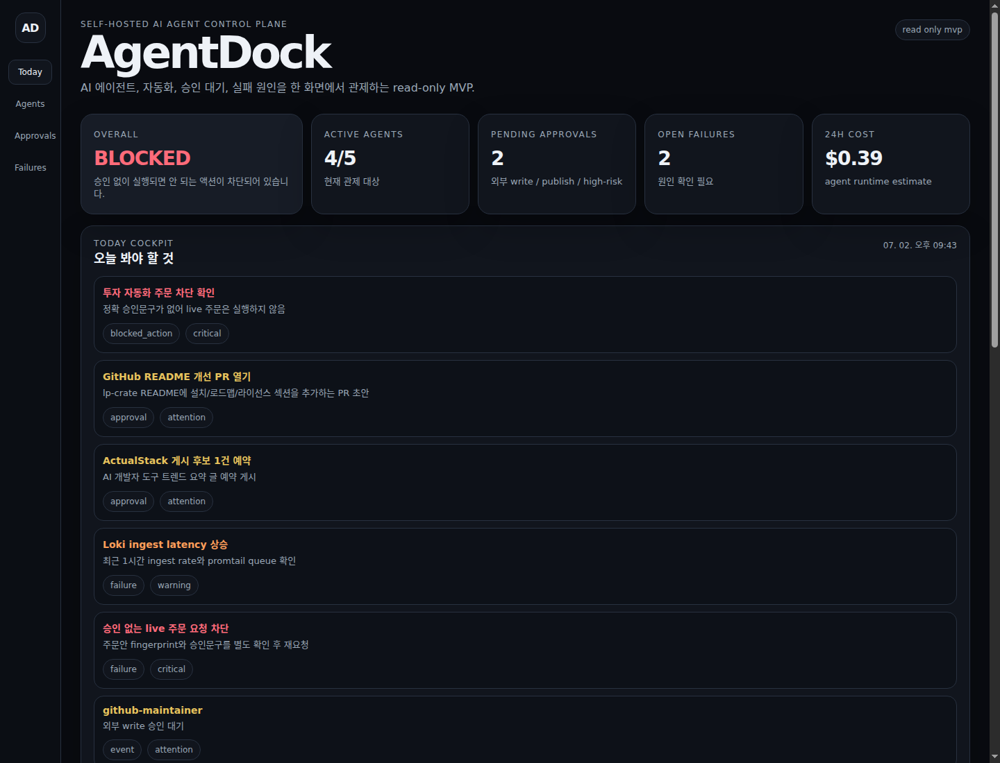

# AgentDock

**Self-hosted control plane for AI agents, automations, approvals, and failure triage.**

AgentDock is an operator cockpit for developers who run multiple AI agents, cron jobs, MCP tools, and personal/team automations. It answers the daily operational questions that generic dashboards do not:

- Which agents/jobs ran recently?
- What failed, and what should I check next?
- Which risky actions are waiting for approval?
- Which connectors are degraded or stale?
- What should the operator review today?



## Why AgentDock

AI agents are becoming part of everyday development workflows, but their operational state is usually scattered across logs, GitHub, cron, chat threads, observability tools, and local scripts. AgentDock focuses on the missing **control-plane layer**: visibility, triage, approvals, connector health, and auditability.

This is not a generic personal dashboard. AgentDock is built around agent operations:

| Surface | Purpose |
| --- | --- |
| Today Cockpit | Prioritized operator queue for blocked actions, approvals, failures, and events |
| Agent Registry | Agent/job status, risk level, last run, and last output |
| Pending Approval | Risky actions that must not run without operator review |
| Failure Triage | Probable cause and suggested next check for failed automations |
| Connectors | Read-only health view of cron/GitHub/calendar/log connectors |
| Activity Timeline | Recent agent and automation events |

## Current MVP

AgentDock v0.1 is intentionally **read-only**. It demonstrates the control-plane shape without requiring production credentials, OAuth, or external write actions.

- Dependency-free Node.js server.
- Static dashboard UI.
- JSON-backed sample read model.
- Redacted public state and summary APIs.
- Fail-closed action boundary: every `POST /api/*` returns `405` with `read_only: true`.
- Contract tests for summary, redaction, fail-closed POSTs, and UI surfaces.
- GitHub Actions CI workflow.

## Quickstart

Requirements:

- Node.js 22+

```bash
git clone <repository-url>
cd agentdock
npm run check
npm test
npm start
```

Open:

```text
http://127.0.0.1:4177
```

## API

| Endpoint | Method | Description |
| --- | --- | --- |
| `/api/health` | GET | Liveness and product mode |
| `/api/summary` | GET | KPIs, overall health, today queue, risk counts |
| `/api/state` | GET | Redacted public read model |
| `/api/*` | POST | Blocked in v0.1, returns `405` and `read_only: true` |

Example:

```bash
curl -sS http://127.0.0.1:4177/api/summary
```

## Safety model

AgentDock starts from a conservative boundary:

1. Read-only connectors first.
2. Approval queue before any external write.
3. Fail-closed POST/action routes.
4. Redacted event and failure summaries.
5. Local/self-hosted by default.

Future action execution should require a durable approval request, exact action fingerprint, operator receipt, policy revalidation, append-only audit log, and replay protection.

## Project structure

```text
data/sample-state.json      sample agent/approval/failure/event/connector state
src/control-plane.js        normalize, redact, summarize read model
src/server.js               GET-only API and static file server
public/                     dashboard UI
test/                       node:test contract tests
docs/                       architecture, roadmap, product brief, submission materials
```

## Roadmap

- v0.2: read-only connector interface, cron connector, GitHub connector, local log connector.
- v0.3: SQLite persistence, append-only event ledger, approval request/receipt schema.
- v0.4: approval detail page, acknowledge/snooze/edit receipt flow, GitHub PR/report integration.
- v1.0: self-hosted agent operations console with approval-gated action bridges.

See [`docs/roadmap.md`](docs/roadmap.md) for details.

## Documentation

- [Product brief](docs/product-brief.md)
- [Architecture](docs/architecture.md)
- [Roadmap](docs/roadmap.md)
- [Submission packet](SUBMISSION.md)
- [Demo script](docs/submission/demo-script-ko.md)
- [OpenAI/Codex OSS application draft](docs/submission/openai-codex-oss-application-draft.md)

## License

MIT — see [`LICENSE`](LICENSE).
