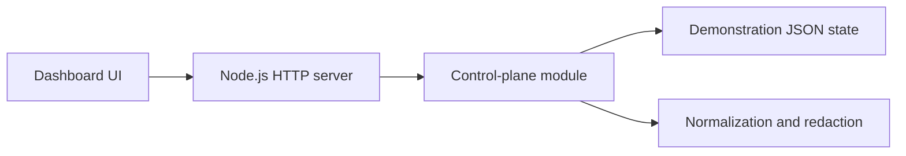

# AgentDock

A self-hosted control-plane prototype for monitoring AI agents, automations, approvals, connector health, and failures.


> **Project status:** AgentDock v0.1 is a read-only MVP backed by demonstration data. It does not currently connect to production services or execute external actions.

## Problem

AI-agent operations are often scattered across logs, cron jobs, repositories, chat threads, and observability tools. This makes several basic questions unnecessarily difficult:

- Which agents ran recently?
- What failed, and what should be checked next?
- Which actions are waiting for approval?
- Which connectors appear stale or degraded?
- What needs operator attention today?

AgentDock explores a single operator cockpit for answering those questions without granting the dashboard write access.

## Current capabilities

| Surface | Purpose |
| --- | --- |
| Today Cockpit | Prioritized queue of approvals, failures, blocked actions, and events |
| Agent Registry | Agent status, risk, recent execution, output, and success rate |
| Approval Queue | Read-only presentation of actions requiring operator review |
| Failure Triage | Probable cause and suggested next check for failed jobs |
| Connector Health | Status and freshness of demonstration connector records |
| Activity Timeline | Recent agent and automation events |

## Architecture



The MVP deliberately uses a small dependency-free architecture:

- A static browser dashboard
- A Node.js HTTP server
- A JSON-backed demonstration read model
- A control-plane module for normalization, redaction, and summaries
- Contract tests for API, UI, and safety boundaries

No production OAuth credentials or external service keys are required.

## Safety properties

AgentDock v0.1 uses a fail-closed boundary:

1. API access is read-only.
2. Every `POST /api/*` request returns `405`.
3. Public state is normalized and redacted before it is returned.
4. Approval records are displayed but cannot execute actions.
5. The bundled dataset represents demonstration state, not live integrations.

These properties are tested as repository contracts.

This prototype is not a production authorization service. It currently has no user authentication, durable approval storage, real connector execution, or multi-user access control.

## Quick start

Requirements:

- Node.js 22 or newer

```bash
git clone https://github.com/j-yoon08/agentdock.git
cd agentdock
npm run check
npm test
npm start
```

Open:

```text
http://127.0.0.1:4177
```

## API

| Endpoint | Method | Description |
| --- | --- | --- |
| `/api/health` | `GET` | Service health and product mode |
| `/api/summary` | `GET` | KPIs, overall health, queue, and risk counts |
| `/api/state` | `GET` | Redacted demonstration read model |
| `/api/*` | `POST` | Blocked with `405` and `read_only: true` |

Example:

```bash
curl -sS http://127.0.0.1:4177/api/summary
```

## Verification

Run syntax checks and the complete test suite:

```bash
npm run check
npm test
```

The tests cover:

- Summary generation
- Sensitive-field redaction
- Fail-closed POST routes
- Health and state endpoints
- Required dashboard surfaces

## Project structure

```text
data/sample-state.json      Demonstration agent and operations state
src/control-plane.js        State normalization, redaction, and summaries
src/server.js               Read-only API and static file server
public/                     Dashboard interface
test/                       Node.js contract tests
docs/                       Architecture, product brief, and roadmap
.github/workflows/          Continuous integration
```

## Engineering focus

AgentDock demonstrates:

- Read-model design for operational dashboards
- Explicit separation between observation and execution
- Fail-closed handling of unsupported actions
- Redaction before API serialization
- Contract-based testing of safety boundaries
- A path from static prototype to approval-gated control plane

## Current limitations

- Connector records are demonstrations and are not synchronized with live services.
- State is loaded from JSON rather than durable storage.
- Approval decisions cannot be submitted.
- Authentication and multi-user authorization are not implemented.
- The MVP should only be run in a trusted local environment.

## Future direction

Potential next steps include:

- Read-only connector interfaces for cron, GitHub, and local logs
- SQLite persistence and an append-only event ledger
- Durable approval request and receipt schemas
- Replay protection and action fingerprinting
- Approval-gated integrations with complete audit trails

See [the roadmap](docs/roadmap.md) for the current design direction.

## License

[MIT](LICENSE)
